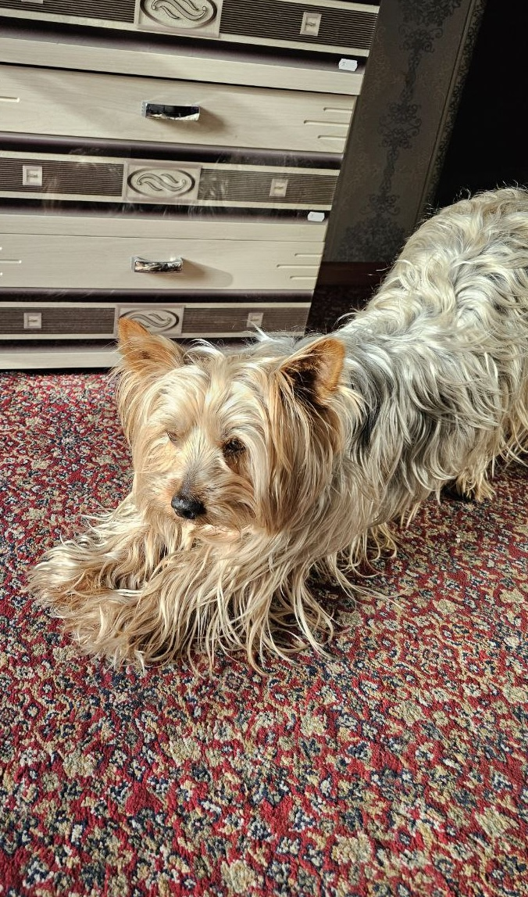

    
     
    
     
    

# Hello, I'm Roman! 🚀

I'm 20 years old and I live in Tula, Russia. Currently, I am studying at Tula College of Construction and Industry Technologies. In spirit, I feel more like a hacker from the movies! 🕵️‍♂️

My major is Information Systems and Programming, and I specialize in developing graphical applications for both desktop and mobile platforms. It's like enjoying a delicious cake for me! 🍰😎

In my free time, I delve into neural network development and computer vision. It seems that 80% of my brain is now written in Python. 🐍💻

I also love collaborating on open-source projects and exploring innovative technologies that can help solve real-world problems. My goal is to contribute to meaningful applications that make a difference in people's lives. 🌍✨

## What I Do

- **Machine Learning & AI:** Developing systems that can learn and adapt to data. 🤖📈
- **Desktop & Mobile Apps:** Crafting seamless applications for desktop and mobile platforms. 📱🎨
- **Web Development:** Bringing ideas to life through dynamic and interactive online interfaces. 🌐💡
- **Computer Vision:** Enabling machines to interpret and understand visual information. 🔍💡

## Achievements

- 🏆 Winner (Prize-winner) of the Regional Championship "Professionals": 2024
- 🌟 Participant in the PRO-Defense of the All-Russian Public Organization "Common Cause": 2024 (International Social Projects)
- 🥇 1st Place at the Student Scientific and Technical Creativity Exhibition: 2024 (Nomination: Information and Video Support of the Educational Space)

## My Favourite Pet

    
    

## My Works Example

    
    

## GitHub Activity

    

## Languages I Speak

    
    
    
    
    
    
    
    
    
    
    
    

## Tools I Use

    
    
    
    
    
    
    
    
    
    
    
    

## IDE I Use

    
    
    
    
    
    
    

## Contact Me

    
    
     
    <a href="mailto:kiyomizudev@gmail.com" style="font-size: 20px; color: #007bff">kiyomizudev@gmail.com</a>

---

    
Made with ❤️ by <a href="https://github.com/kiyomizudev" style="color: #007bff;">kiyomizudev</a>

