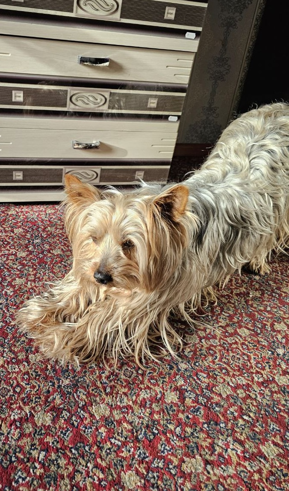
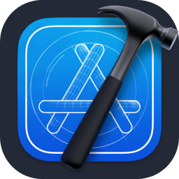

    
     
    
     
    

# Привет, я Роман! 🚀

Мне 20 лет, и я живу в Туле, Россия. В настоящее время я учусь в Тульском колледже строительства и отраслевых технологий. По духу я больше похож на хакера из фильмов! 🕵️‍♂️

Моя специальность — информационные системы и программирование, и я занимаюсь разработкой графических приложений для настольных и мобильных платформ. Это для меня как наслаждение от вкусного торта! 🍰😎

В свободное время я увлекаюсь разработкой нейронных сетей и компьютерным зрением. Кажется, что 80% моего мозга теперь написано на Python. 🐍💻

Я также люблю сотрудничать над проектами с открытым исходным кодом и изучать инновационные технологии, которые могут помочь решить реальные проблемы. Моя цель — внести вклад в значимые приложения, которые меняют жизнь людей. 🌍✨

## Чем я занимаюсь

- **Машинное обучение и искусственный интеллект:** Разрабатываю системы, которые могут учиться и адаптироваться к данным. 🤖📈
- **Настольные и мобильные приложения:** Создаю бесшовные приложения для настольных и мобильных платформ. 📱🎨
- **Веб-разработка:** Воплощаю идеи в жизнь через динамические и интерактивные онлайн-интерфейсы. 🌐💡
- **Компьютерное зрение:** Обеспечиваю машинам возможность интерпретировать и понимать визуальную информацию. 🔍💡

## Достижения

- 🏆 Победитель (призер) регионального чемпионата "Профессионалы": 2024
- 🌟 Участник ПРО-защиты общероссийской общественной организации "Общее дело": 2024 (Международные социальные проекты)
- 🥇 1 место на выставке научно-технического творчества студентов: 2024 (Номинация: Информационное и видео-обеспечение образовательного пространства)

## Мой любимый питомец

    
    

## Пример моей работы

    
    

## Активность на GitHub

    

## Языки программирования, которые я знаю

    
    
    
    
    
    
    
    
    
    
    
    

## Инструменты, которыми я пользуюсь

    
    
    
    
    
    
    
    
    
    
    
    

## IDE, которыми я пользуюсь

    
    
    
    
    
    
    

## Связаться со мной

    
    
     
    <a href="mailto:kiyomizudev@gmail.com" style="font-size: 20px; color: #007bff">kiyomizudev@gmail.com</a>

---

    
Сделано с ❤️ <a href="https://github.com/kiyomizudev" style="color: #007bff;">kiyomizudev</a>

